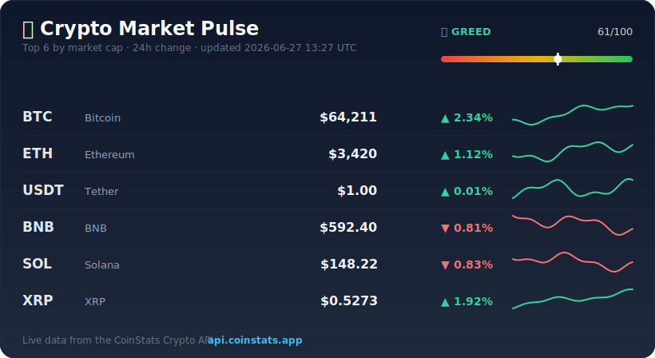

<div align="center">

# ₿ crypto-pulse

**A live terminal crypto dashboard *and* a self-updating README card — both powered by the [CoinStats Crypto API](https://coinstats.app/api/).**

[](https://github.com/scsona/crypto-pulse/actions/workflows/ci.yml)
[](https://github.com/scsona/crypto-pulse/actions/workflows/update-card.yml)
[](LICENSE)
[](https://www.python.org/)
[](https://coinstats.app/api/)

</div>

## 👇 This card is live

The image below is **regenerated every 6 hours by GitHub Actions** and committed straight back into the repo — so this README is its own running demo. Scroll down to see how.

<div align="center">



</div>

> The numbers above come from the **[CoinStats Crypto API](https://coinstats.app/api/)** → [`/coins`](https://coinstats.app/api/) for prices and [`/coins/{id}/charts`](https://coinstats.app/api/) for the sparklines.

---

## What it does

`crypto-pulse` has two faces, one engine:

| | |
|---|---|
| 🖥️ **`dash`** | A live terminal dashboard — prices, 1h/24h/7d changes, unicode sparklines, top gainer/loser, and a colour-coded **Market Pulse** gauge that refreshes in place. |
| 🖼️ **`card`** | Renders a self-contained `.svg` "market pulse" card (the one above). Pure stdlib, no browser, GitHub-safe. Drop it in any README and let CI keep it fresh. |

### The dashboard

```
          ₿ CRYPTO PULSE  ·  live crypto dashboard powered by the CoinStats Crypto API

    #  Coin                       Price          1h         24h          7d  24h trend                 Mkt Cap
    1  BTC  Bitcoin             $64,211     ▲ 0.21%     ▲ 2.34%     ▲ 5.10%  ▃▂▁▂▃▄▄▅▇█▇▇▇▇██           $1.27T
    2  ETH  Ethereum             $3,420     ▲ 0.12%     ▲ 1.12%     ▲ 3.42%  ▃▃▃▂▁▂▄▆▇▇██▇▅▅▆         $411.00B
    3  SOL  Solana              $148.22     ▲ 0.45%     ▼ 0.83%     ▲ 8.74%  ▆▆▆▅▅▆██▆▅▅▄▂▁▂▄          $68.90B

╭───────────────────────────── Market Pulse ─────────────────────────────╮
│  🙂  Greed   61/100                                                       │
│  ━━━━━━━━━━━━━━━━━━━◆━━━━━━━━━━━━                                         │
│  Breadth  5▲ 3▼   (62% up)                                               │
│  Weighted 24h  ▲ 1.68%                                                    │
│  Top gainer  ADA ▲ 3.06%      Top loser  DOGE ▼ 2.14%                     │
╰──────────────────────────────────────────────────────────────────────────╯
```

## Quick start

```bash
git clone https://github.com/scsona/crypto-pulse.git
cd crypto-pulse
pip install -e .            # installs `rich`; the card generator needs only stdlib
```

### 1. Get a free API key

Grab a key (free tier = 20,000 credits/month) at **<https://coinstats.app/api/>**, then:

```bash
cp .env.example .env        # paste your key into .env
# or:  export COINSTATS_API_KEY=your_key_here
```

### 2. Run it

```bash
crypto-pulse dash                  # live dashboard, refreshes every 30s
crypto-pulse dash --limit 20 -i 15 # top 20 coins, refresh every 15s
crypto-pulse card -o assets/market-pulse.svg   # render the SVG card

crypto-pulse dash --demo           # try it with no key — uses bundled sample data
crypto-pulse card --demo           # ditto for the card
```

No key handy? Every command supports `--demo` for an offline preview.

## Make the README card update itself

This repo ships a GitHub Action ([`.github/workflows/update-card.yml`](.github/workflows/update-card.yml)) that regenerates the card on a schedule and commits it. To use it in **your** repo:

1. Add a repository secret named `COINSTATS_API_KEY` (Settings → Secrets and variables → Actions). Get the value from the [CoinStats Crypto API](https://coinstats.app/api/) dashboard.
2. Embed the card anywhere in your README:
   ```markdown
   
   ```
3. That's it — the workflow runs every 6 hours (and on demand via **Run workflow**). Without the secret it falls back to demo data, so forks never break.

## How the Market Pulse is calculated

It's a deliberately **transparent heuristic** — *not* the official Fear & Greed index. Two signals from the top coins are blended into a single 0–100 score:

- **Momentum (65%)** — the market-cap-weighted average 24h price change.
- **Breadth (35%)** — the share of tracked coins that are up over 24h.

| Score | Mood |
|------:|------|
| 0–24 | 😱 Extreme Fear |
| 25–44 | 😟 Fear |
| 45–55 | 😐 Neutral |
| 56–74 | 🙂 Greed |
| 75–100 | 🤑 Extreme Greed |

The weights live at the top of [`crypto_pulse/pulse.py`](crypto_pulse/pulse.py) — tweak them and you change the mood.

## Which CoinStats endpoints it uses

All requests go to `https://openapiv1.coinstats.app` with your key in the `X-API-KEY` header.

| Endpoint | Used for |
|----------|----------|
| `GET /coins` | prices, market caps, 1h/24h/7d changes |
| `GET /coins/{coinId}/charts` | the sparklines and mini-charts |

See the full reference and grab a key at **[coinstats.app/api](https://coinstats.app/api/)**.

## Project layout

```
crypto_pulse/
  api.py          # stdlib CoinStats client (X-API-KEY, retries)
  dashboard.py    # the rich terminal UI
  svgcard.py      # GitHub-safe SVG card renderer
  pulse.py        # the Market Pulse heuristic
  sparkline.py    # unicode sparklines
  sample_data.py  # frozen snapshot for --demo
  cli.py          # `crypto-pulse dash` / `crypto-pulse card`
scripts/generate_card.py   # entry point for the GitHub Action
.github/workflows/         # CI + the self-updating card job
```

## Development

```bash
pip install -e . pytest
pytest -q
```

## License

[MIT](LICENSE) © scsona

<div align="center">
<sub>Market data by the <a href="https://coinstats.app/api/">CoinStats Crypto API</a>. Not financial advice.</sub>
</div>
